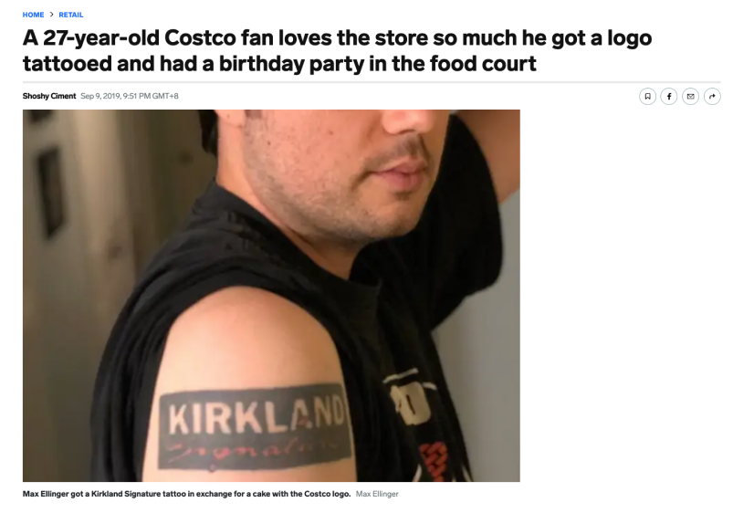

### **Introduction**

This article aims to dive into the successful business model of Costco Wholesale Corporation, drawing some personal insights or business logic from the case study of Costco Companies, Inc. [^1], to see why and how it works, and what makes it keep working.

Whether in physical brick-and-mortar retail or online e-commerce, both serve as different manifestations of the distribution industry, ultimately acting as intermediaries to efficiently match supply and demand. From this point, Costco is a platform business for me, only in the form of early retail channel. So the Costco case holds valuable benckmarks for the retail industry's business models.

While studying the Costco Companies, Inc. case, I was particularly intrigued by the source of its competitive advantage. Based on my knowledge of management studies, maintaining a competitive advantage typically stems from either product or service innovation or through the specialized allocation of marketing assets. 

However, before establishing its own sales capabilities to drive private label brands, Costco initially sold mostly non-owned products and did not offer any groundbreaking services or establish a seemingly unreplicable model for newcomers. Costco's operating costs, compared to its competitors, were notably lower, and their marketing tactics appeared "ordinary." This raises the question of how Costco generates profits and achieves such a significant scale.

### Membership

#### **Membership is one of the strategic key, but not the whole picture of model sustainability**

Costco employs a membership fee system, also known as a *subscription model*. Membership-based businesses were not unique to Costco; In fact, in the United States, many traditional industries, like gyms, clubs, adopted this pure subscription-based charging model during the same period. Nowadays, numerous platforms and software companies derive benefits from this model, especially the freemium model derived from SaaS (Software as a Service). However, at that time, the rules only allowed paying members to be eligible for purchasing products or services, typically with the option to renew on an annual basis. Several membership plans were available for consumers to choose from.

Even in the 1980s, Costco did not adopt a novel business model that required the possession of scarce or irreplaceable resources to disrupt the industry's game rules.[^3] However, one advantageous aspect was that the founders had prior experience and knowledge in a similar industry, which they brought to Costco.

Looking from the perspective of the external competitive environment, is it merely due to the high imitation cost of switching to this different operating model that competitors who adopted different operating methods were unwilling to change (either difficult or did not see the need to change), allowing Costco to have room for competitive growth?

#### The stable cash flows from membership help achieve the great expansion

According to the information provided in the case, when Costco was established for 15 years, its global store count reached 278, with coverage in half of the states in the United States. It also began expanding to the United Kingdom and Asian countries. By the end of 2018, the global operation had grown to 782 stores. Despite the competitive pressure from e-commerce leader Amazon, the number of stores added after 2011 was still 190. Although the expansion was not predominantly focused on the Americas, this figure roughly maintained an average annual expansion rate of 15 to 20 stores. In other words, Costco successfully opened at least one store globally every month. This number is quite astonishing to me.

The IKEA and Ingvar Kamprad case presents a similar situation where the rate of store expansion likely represents a strong internationalization strategy. To continuously achieve strategic goals, companies must have corresponding organizational structures and resources. IKEA's approach involves dividing into expansion and operation groups, with the expansion group completing phase-specific tasks before transferring them to the operation group.

So here I came up with a hypothesis: 
> Under this model, a hidden key strategic goal for Costco is to continuously expand its business scale, thus obtaining stronger bargaining power and a more solid brand image."

Why do I think this way? Normally, all companies including retailers would want to be as large as possible, right?

A larger scale represents stronger bargaining power with upstream suppliers. Strong bargaining power means lower unit costs and a higher markup percentage under the same price range. Disassembling the formula of the DuPont Analysis reveals that a high product profit margin leads to a high return on equity (ROE), which intuitively demonstrates the benefits brought by "scale."

Another item in the same formula that can increase the target ROE is the asset turnover rate. By efficiently utilizing assets in sales, even in the case of low-profit margins, ROE can be increased. Compared to its competitors, Costco's sales profit margin is notably low, and it becomes even lower when excluding private label brands. The factor that supports Costco in achieving its scale is its high turnover rate.

### The Unique Setting
#### Product, 

What makes Costco's approach unique is that "scale" is not solely measured by the absolute"purchasing quantity". In terms of total purchasing volume, Costco may not necessarily exceed larger retail leaders like Walmart, Target or so. However, Costco's key layout for achieving "scale" lies in its **low Stock Keeping Unit (SKU) setting**, giving it a relative advantage in specialized specifications. [^4]

> Significantly Lower SKU is the "less is more" philosophy in the retail game.  

Costco leverages its scale advantage to consistently achieve a low-cost strategy and fulfill its promises to customers. From the perspective of both retailers and suppliers, Costco's low SKU setting allows it to maintain strong bargaining power and collaborative relationships, even with weaker brands. 

For these types of suppliers, gaining access to such a distribution channel is akin to breaking free from being placed alongside competitors on shelves, reducing the uncertainty of leaving the choice in the hands of consumers. This aspect significantly influences the internal and external configurations of the company, including sales models, marketing strategies, and organizational staffing internally, as well as response options to competitors' strategies or changes in consumer preferences externally.

#### Branding, one-of-a-kind positioning
Within the context of penetrating the market with a low-cost strategy and achieving high product turnover through low SKU, the brand profile of Costco as a "respected purchasing agent" is becoming increasingly clear. To successfully fulfill this role, several key competencies come into play, namely, "product selection capability" and "persuasiveness."

These two critical competencies, product selection capability and persuasiveness, give rise to a series of challenges such as whether they can be replicated or surpassed by competitors. This determines Costco's position in physical retail and can also be used to assess its entry strategies in international markets.

### **The Model and its Flow**

### Acquisition 
#### How customers land in Costco membership?

The initial challenge in the membership subscription model is: **How to incentivize consumers to become members and acquire customers effectively?**

Costco initially targeted corporate customers as their core clientele, rather than the more numerous general consumer population. These core customers, known as "Gold Star Members," were selected because they are more cost-conscious and aligned with Costco's value proposition. For Costco members, the decision to subscribe generally boils down to whether the utility gained from their purchases outweighs the membership fee before it expires. In simpler terms, members often adopt the mindset of "Although I have to pay a fee, if the money saved from my purchases outweighs the fee, it's worth it," and they may even feel like they are getting a bargain.

However, Costco's intention to expand its scale does not stop at this stage, where the sole focus is on maximizing membership fee revenue.

In reality, not every customer exhibits a mindset of seeking bargains, due to customer heterogeneity. Yet, if we make the extreme assumption that every customer subscribes and makes purchasing decisions based on this mindset of "rationality," Costco would incur losses with every membership sold. So, why would they want to enlarge their market and incur even more losses? The reason Costco's business model is referred to as a "**Loss Leader Model**" lies in this aspect. There are always a few specially priced items that attract customers and make it irresistible for them not to shop or continue their membership.

In fact, the revenue from membership fees does not lead to significant gains or losses for Costco. Membership fees contribute to approximately 2% of its total revenue and less than 20% of its overall profit. Although the financial reports show a higher figure for membership fee revenue (around £3 billion) compared to pre-tax profit from sales activities (which is approximately £1 billion after deducting product costs and SG&A expenses), this does not imply that Costco's economic logic is supported by membership fees alone.

### **Activation, Retention & Referral: How customer engage and how it become a brand asset to the company**

After acquiring members, the second stage involves addressing member retention, which refers to how Costco can continuously engage customers, retain them, and even encourage them to refer others. Customer churn is a common issue in any industry, especially in the competitive retail environment. According to a report by Morgan Stanley, there is significant overlap between Amazon Prime and Costco members, with nearly half of the individuals holding both memberships. This coexistence represents an exceptional case of extreme differentiation within the same industry. In general, it's a situation of "kill or be killed," where customer engagement and churn rates serve as signals of competitive dynamics within the company.

> Costco's general membership renewal rate is 84%, while the Gold Star member renewal rate is 97%. The average spending amount is $94, with a purchase frequency of approximately 2.5 weeks.
> 

From a numerical perspective, Costco truly sets an example in this regard. Their customer loyalty is high, and their member demographics show higher levels of education and income compared to competitors. In conclusion, Costco's members are of high value and exhibit strong loyalty.

Costco fanboy did crazy stuffs. Not only did he get a tattoo of Kirkland Signature brand on his arm, He also had his birthday party in the Costco food court in 2015 and once took a date to the store. [^7]

This extreme case is somehow related to the internal setup mentioned earlier.   

How does Costco achieve internal consistency? Through their store design, which includes high ceilings, rugged decor, warehouse-style shelves, and hanging spotlights. Within limited space that is typically smaller than the industry average, Costco employs a display approach that showcases a carefully selected assortment of products stacked in bulk. This emphasizes the "Best Deal" concept, making customers feel like every item has been handpicked and their shopping behavior is taken seriously. This is also why Costco verifies membership upon entry and has staff at the exit to mark the receipts—a ritual essential to the Costco shopping experience.

The whole setting sticks to Costco's role and contradict to the brand marketing argument towards higher customer loyalty would correlate to premium branding strategy. See how Costco did, it's a lower-end premium vibe, but it works so well on the metrics and the fanboy story. 

Improving customer experience doesn't necessarily require a focus on premium elements. In this case, we can see the importance and necessity of internal consistency. While adhering to a low-cost strategy, Costco embodies the role of a trustworthy salesperson who can deliver value and create a sense of security. Costco relies on word-of-mouth marketing derived from this down-to-earth shopping experience.

From what we've seen so far, the underlying business logic aligns with the Pirate model(AARRR model). If we were to apply this model to Costco, it would be an optimized version. Unlike the traditional Pirate Metrics model, which aims for revenue from customer acquisition to the final stage, with each marketing campaign having a limited impact, Costco's model operates within a membership system, creating a positive cycle that helps in the early stages of the conversion funnel (see diagram below).

The last "R" in the model, in my interpretation, stands for "Raise" and "Recycle." What does this entail? We can discuss several directions:

1. **Elevating the price range of products**
    
    Costco's products are known for their high value proposition, emphasizing high quality under the premise of cost-effectiveness, rather than merely focusing on low prices. They claim to cater to customers who value the monetary aspect. These customers may be highly involved, but it doesn't mean there is a limit to the amount they are willing to spend. Therefore, Costco can also sell luxury items such as crystal chandeliers, diamond rings, and yachts. This reflects the potential for an increase in the price range customers are willing to consider.
    
2. **Expanding the scope of products**
    
    Costco's store layout typically guides customers first to large appliances and household essentials on different floors. These products usually have a larger size and higher unit price. If customers prioritize purchasing groceries and other items with limited shopping cart space, it may reduce the possibility of buying these larger products. This approach is quite the opposite of IKEA's "Open Your Wallet Strategy," which starts with low-priced small items to stimulate desire for more significant purchases.
    
3. **Enhancing brand identity**
    
    Costco's value proposition revolves around providing customers with low-priced, high-quality goods and a treasure-hunt-like shopping experience. An essential part of Costco's economic logic is their private label brand, Kirkland SignatureTM. From groceries and daily essentials to clothing, these private label products offer both attractive prices and quality. When customers develop a stronger sense of brand identity, it is reflected in increased purchases of these Costco private label items. In fact, Costco has an unwritten rule that if they find a brand's product to be truly competitive, they will stop offering their private label version. This demonstrates their commitment to enhancing brand identity.
    

The effects of improvement in any of these directions may manifest over multiple periods. As long as customers maintain their membership, they will bring sustainable returns to Costco and increase the probability of the next cycle.

![](https://mermaid.ink/img/eyJjb2RlIjoiZ3JhcGggVERcbiAgQVtcXENvbnN1bWVyIG1hcmtldC9dID09PnxMb3NzIExlYWRlciBNb2RlbHwgQigoTWVtYmVyc2hpcCkpXG4gIEIgPT0-IHxDb25zaXN0ZW50IEN1c3RvbWVyIEV4cGVyaWVuY2V8IENbKExveWFsIEN1c3RvbWVyIEJhc2UpXVxuICBDIC0tPnxMb3lhbHR5IGJlaGF2aW9yIEl8IERbKyBQcmljZSByYW5nZV1cbiAgQyAtLT58TG95YWx0eSBiZWhhdmlvciBJSXwgRVsrIFByb2R1Y3Qgc2NvcGVdXG4gIEMgLS0-fExveWFsdHkgYmVoYXZpb3IgSUlJfCBGWysgUHJpdmF0ZSBMYWJlbF1cbiAgRCAmIEUgJiBGIC0tcmVuZXdhbCAlLS0-IEJcbiAgRCAmIEUgJiBGIC0uV09NLi0-IEFcbiAgQiAtLT4gfCsgQnJhbmQgRXF1aXR5fENcbiAgRCAtLi0gRVxuICBFIC0uLSBGIiwibWVybWFpZCI6eyJ0aGVtZSI6Im5ldXRyYWwiLCJ0aGVtZVZhcmlhYmxlcyI6eyJwcmltYXJ5Q29sb3IiOiIjZWVlIiwiY29udHJhc3QiOiIjMjZhIiwic2Vjb25kYXJ5Q29sb3IiOiJoc2woMjEwLCA2Ni42NjY2NjY2NjY3JSwgOTUlKSIsImJhY2tncm91bmQiOiIjZmZmZmZmIiwidGVydGlhcnlDb2xvciI6ImhzbCgtMTYwLCAwJSwgOTMuMzMzMzMzMzMzMyUpIiwicHJpbWFyeUJvcmRlckNvbG9yIjoiaHNsKDAsIDAlLCA4My4zMzMzMzMzMzMzJSkiLCJzZWNvbmRhcnlCb3JkZXJDb2xvciI6ImhzbCgyMTAsIDI2LjY2NjY2NjY2NjclLCA4NSUpIiwidGVydGlhcnlCb3JkZXJDb2xvciI6ImhzbCgtMTYwLCAwJSwgODMuMzMzMzMzMzMzMyUpIiwicHJpbWFyeVRleHRDb2xvciI6IiMxMTExMTEiLCJzZWNvbmRhcnlUZXh0Q29sb3IiOiJyZ2IoMjEuMjUsIDEyLjc1LCA0LjI1KSIsInRlcnRpYXJ5VGV4dENvbG9yIjoicmdiKDE3LjAwMDAwMDAwMDEsIDE3LjAwMDAwMDAwMDEsIDE3LjAwMDAwMDAwMDEpIiwibGluZUNvbG9yIjoiIzY2NiIsInRleHRDb2xvciI6IiMwMDAwMDAiLCJhbHRCYWNrZ3JvdW5kIjoiaHNsKDIxMCwgNjYuNjY2NjY2NjY2NyUsIDk1JSkiLCJtYWluQmtnIjoiI2VlZSIsInNlY29uZEJrZyI6ImhzbCgyMTAsIDY2LjY2NjY2NjY2NjclLCA5NSUpIiwiYm9yZGVyMSI6IiM5OTkiLCJib3JkZXIyIjoiIzI2YSIsIm5vdGUiOiIjZmZhIiwidGV4dCI6IiMzMzMiLCJjcml0aWNhbCI6IiNkNDIiLCJkb25lIjoiI2JiYiIsImFycm93aGVhZENvbG9yIjoiIzMzMzMzMyIsImZvbnRGYW1pbHkiOiJcInRyZWJ1Y2hldCBtc1wiLCB2ZXJkYW5hLCBhcmlhbCIsImZvbnRTaXplIjoiMTZweCIsIm5vZGVCa2ciOiIjZWVlIiwibm9kZUJvcmRlciI6IiM5OTkiLCJjbHVzdGVyQmtnIjoiaHNsKDIxMCwgNjYuNjY2NjY2NjY2NyUsIDk1JSkiLCJjbHVzdGVyQm9yZGVyIjoiIzI2YSIsImRlZmF1bHRMaW5rQ29sb3IiOiIjNjY2IiwidGl0bGVDb2xvciI6IiMzMzMiLCJlZGdlTGFiZWxCYWNrZ3JvdW5kIjoid2hpdGUiLCJhY3RvckJvcmRlciI6ImhzbCgwLCAwJSwgODMlKSIsImFjdG9yQmtnIjoiI2VlZSIsImFjdG9yVGV4dENvbG9yIjoiIzMzMyIsImFjdG9yTGluZUNvbG9yIjoiIzY2NiIsInNpZ25hbENvbG9yIjoiIzMzMyIsInNpZ25hbFRleHRDb2xvciI6IiMzMzMiLCJsYWJlbEJveEJrZ0NvbG9yIjoiI2VlZSIsImxhYmVsQm94Qm9yZGVyQ29sb3IiOiJoc2woMCwgMCUsIDgzJSkiLCJsYWJlbFRleHRDb2xvciI6IiMzMzMiLCJsb29wVGV4dENvbG9yIjoiIzMzMyIsIm5vdGVCb3JkZXJDb2xvciI6ImhzbCg2MCwgMTAwJSwgMjMuMzMzMzMzMzMzMyUpIiwibm90ZUJrZ0NvbG9yIjoiI2ZmYSIsIm5vdGVUZXh0Q29sb3IiOiIjMzMzIiwiYWN0aXZhdGlvbkJvcmRlckNvbG9yIjoiIzY2NiIsImFjdGl2YXRpb25Ca2dDb2xvciI6IiNmNGY0ZjQiLCJzZXF1ZW5jZU51bWJlckNvbG9yIjoid2hpdGUiLCJzZWN0aW9uQmtnQ29sb3IiOiJoc2woMjEwLCA2Ni42NjY2NjY2NjY3JSwgNzAlKSIsImFsdFNlY3Rpb25Ca2dDb2xvciI6IndoaXRlIiwic2VjdGlvbkJrZ0NvbG9yMiI6ImhzbCgyMTAsIDY2LjY2NjY2NjY2NjclLCA3MCUpIiwidGFza0JvcmRlckNvbG9yIjoiaHNsKDIxMCwgNjYuNjY2NjY2NjY2NyUsIDMwJSkiLCJ0YXNrQmtnQ29sb3IiOiIjMjZhIiwidGFza1RleHRMaWdodENvbG9yIjoid2hpdGUiLCJ0YXNrVGV4dENvbG9yIjoid2hpdGUiLCJ0YXNrVGV4dERhcmtDb2xvciI6IiMzMzMiLCJ0YXNrVGV4dE91dHNpZGVDb2xvciI6IiMzMzMiLCJ0YXNrVGV4dENsaWNrYWJsZUNvbG9yIjoiIzAwMzE2MyIsImFjdGl2ZVRhc2tCb3JkZXJDb2xvciI6ImhzbCgyMTAsIDY2LjY2NjY2NjY2NjclLCAzMCUpIiwiYWN0aXZlVGFza0JrZ0NvbG9yIjoiI2VlZSIsImdyaWRDb2xvciI6ImhzbCgwLCAwJSwgOTAlKSIsImRvbmVUYXNrQmtnQ29sb3IiOiIjYmJiIiwiZG9uZVRhc2tCb3JkZXJDb2xvciI6IiM2NjYiLCJjcml0QmtnQ29sb3IiOiIjZDQyIiwiY3JpdEJvcmRlckNvbG9yIjoiaHNsKDEwLjkwOTA5MDkwOTEsIDczLjMzMzMzMzMzMzMlLCA0MCUpIiwidG9kYXlMaW5lQ29sb3IiOiIjZDQyIiwibGFiZWxDb2xvciI6ImJsYWNrIiwiZXJyb3JCa2dDb2xvciI6IiM1NTIyMjIiLCJlcnJvclRleHRDb2xvciI6IiM1NTIyMjIiLCJjbGFzc1RleHQiOiIjMTExMTExIiwiZmlsbFR5cGUwIjoiI2VlZSIsImZpbGxUeXBlMSI6ImhzbCgyMTAsIDY2LjY2NjY2NjY2NjclLCA5NSUpIiwiZmlsbFR5cGUyIjoiaHNsKDY0LCAwJSwgOTMuMzMzMzMzMzMzMyUpIiwiZmlsbFR5cGUzIjoiaHNsKDI3NCwgNjYuNjY2NjY2NjY2NyUsIDk1JSkiLCJmaWxsVHlwZTQiOiJoc2woLTY0LCAwJSwgOTMuMzMzMzMzMzMzMyUpIiwiZmlsbFR5cGU1IjoiaHNsKDE0NiwgNjYuNjY2NjY2NjY2NyUsIDk1JSkiLCJmaWxsVHlwZTYiOiJoc2woMTI4LCAwJSwgOTMuMzMzMzMzMzMzMyUpIiwiZmlsbFR5cGU3IjoiaHNsKDMzOCwgNjYuNjY2NjY2NjY2NyUsIDk1JSkifX0sInVwZGF0ZUVkaXRvciI6ZmFsc2V9)

[^1]: Costco Companies, Inc. by David E. Bell and Ann Leamon, [link](https://store.hbr.org/product/costco-companies-inc/599041)

[^3]: It was during that time when Jeff Bezos was still in college.
[^4]: based on the case information: Costco Warehouse ~4,000；typical supermarket ~30,000SKUs，Discounter like Kmart 40,000-60,000SKUs;Supercenter ~200,000SKUs
[^7]: https://www.businessinsider.com/costco-obsessed-man-has-a-kirkland-signature-tattoo-2019-9