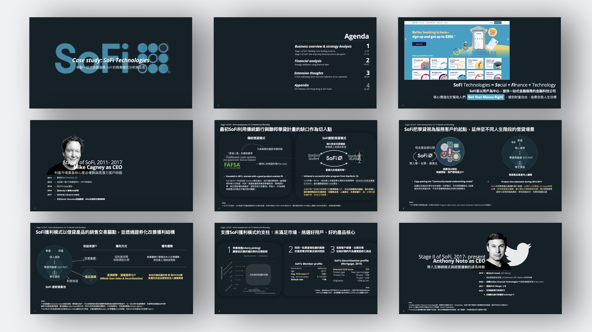
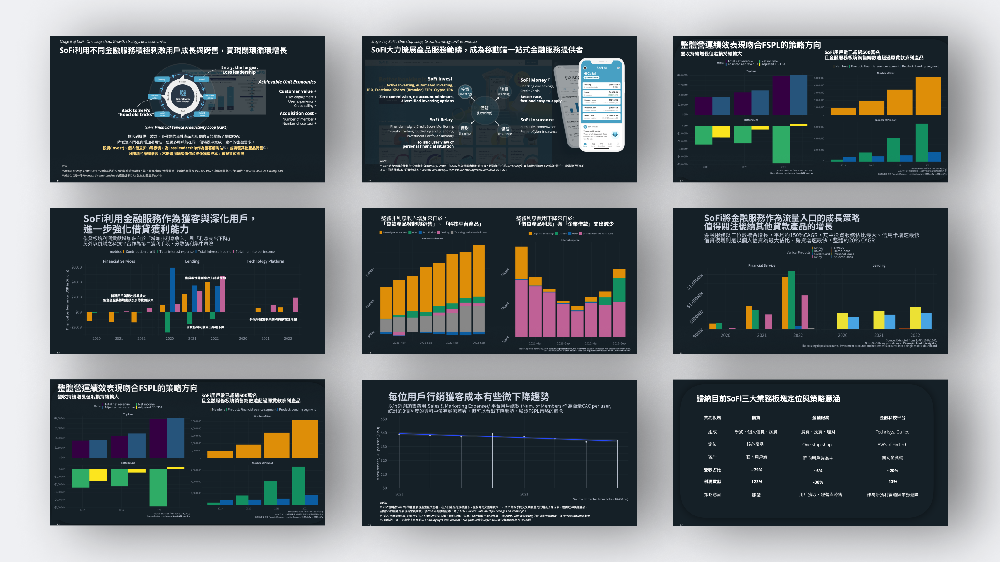

### **Overview** 
Strategy Analysis on SoFi’s Business Models

<!--  -->

<object data="./pdf/sofi_demo.pdf" type="application/pdf" width="800px" height="450px">
    <embed src="./pdf/sofi_demo.pdf">
        
Demo Deck <a href="http://yoursite.com/the.pdf">Download PDF</a>.

    </embed>
</object>

