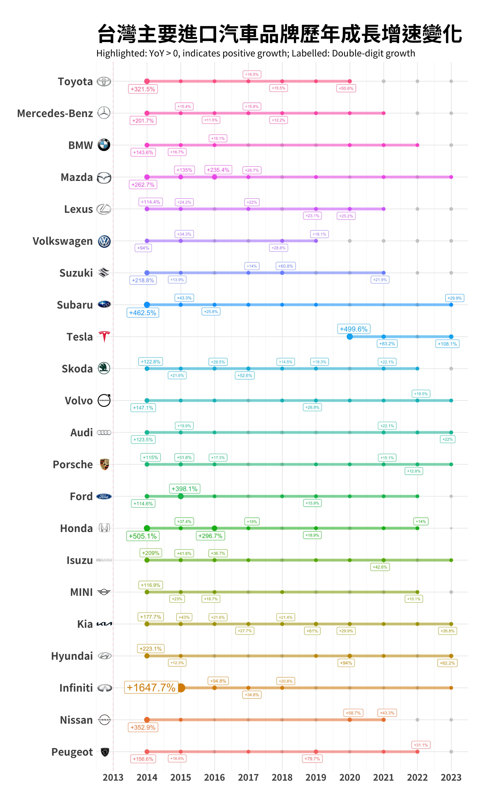
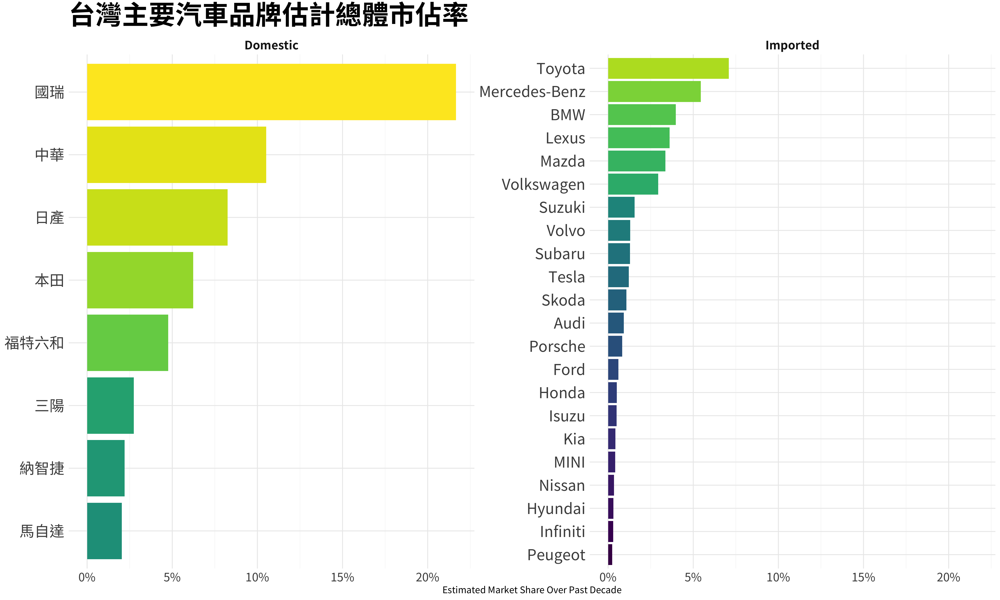
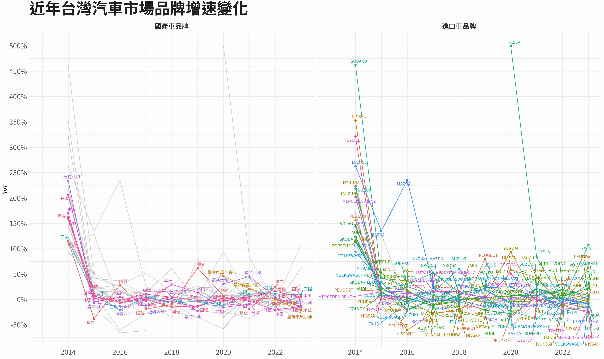
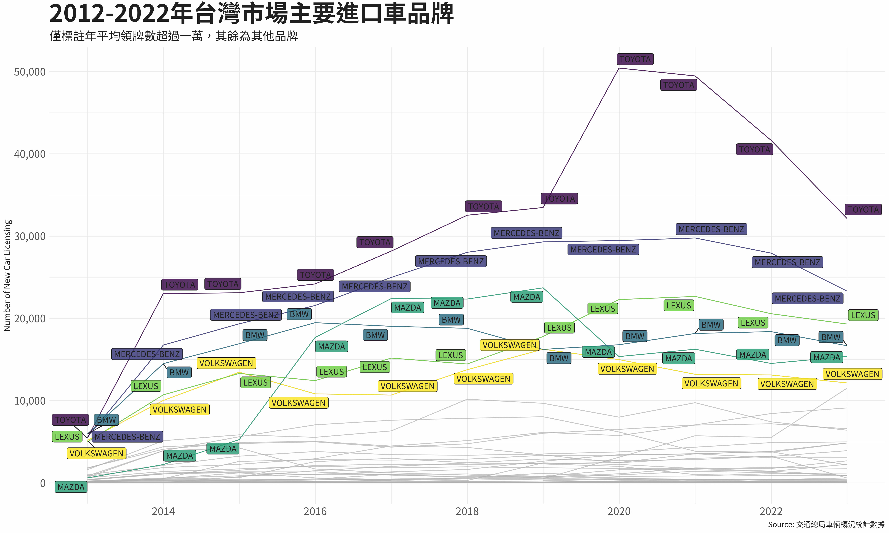
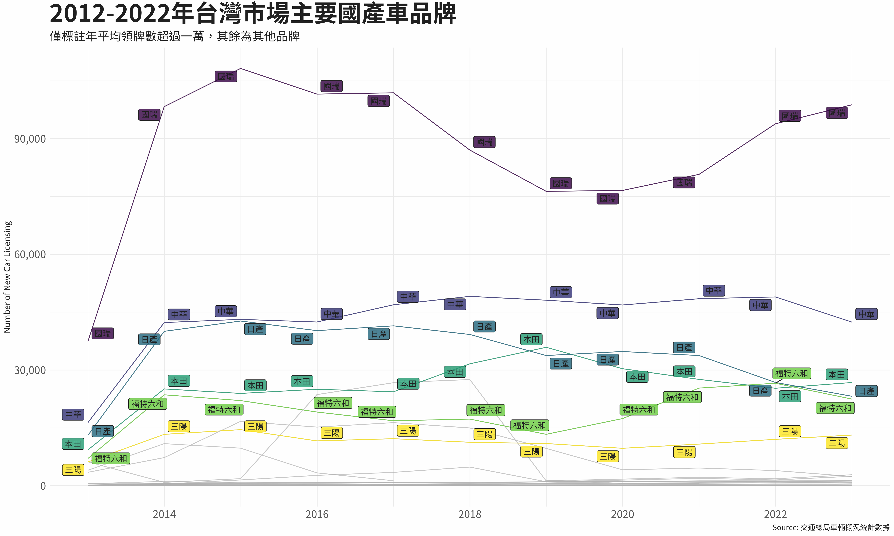

### **Overview**

### **Findings**

1. Due to the disruptive impact of the electric vehicle leader Tesla in the market, Taiwanese consumers' strong preference for Japanese car manufacturers has gradually declined to the level of other European car manufacturers in recent years. Major Japanese car manufacturers such as Subaru, Nissan, Toyota, and Mazda have experienced a significant slowdown in growth.

2. The overall imported car market in Taiwan is showing a growth trend, with a peak in 2020 that squeezed the domestic car market.

3. In the domestic car market in Taiwan, "國瑞" is significantly ahead of its competitors, leading to overall market stability. However, it lacks the driving force for further growth.

###### **Data Source**

交通部公路總局統計新車領牌數－按廠牌及燃料別分(汽車), [url](https://stat.thb.gov.tw/hb01/webMain.aspx?sys=100&funid=11100)

