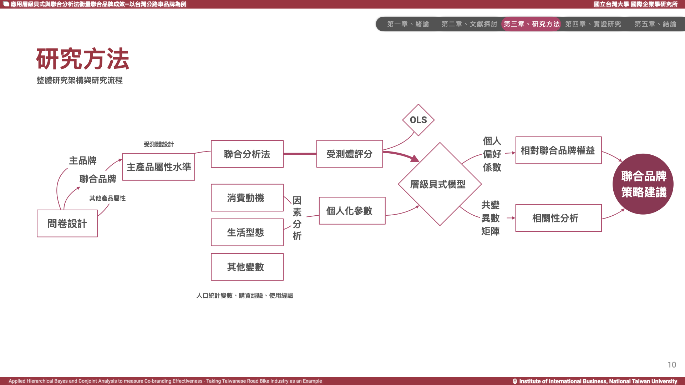

### **Overview**

### **Introduction** 

Either product or branding strategy is vital in any industry environment full of highly competitive players. However, firms do not really have to compete with others to stay competitive all the time. There are chances that firm could win out by gaining strengths from the wisely­-chosen partners. The term ”Coopetition” by Brandenburger and Nalebuff shed some lights on the spirit of ”Co­branding”. Co­branding has become ubiquitous in these years, commonly seen as a cooperative marketing strategy to improve brand equity, to penetrate the new product market, while maintaining competitive advantages in the industries.

In this research, taking bicycle industry in Taiwan as an example, we incorporate the ”Co­branding” attribute within the context of conjoint analysis to measure the change of preference when a guest brand is introduced. Hierarchical Bayes model are the main statistical approach to address the heterogeneity of consumer preferences and data scarcity of individuals given different co­branding scenarios of main product, road bike. Trade­off analysis and correlation analysis are then used to evaluate the relative worth of co­branding strategy. Based on these empirical results, we conclude different strategic options for firms given their current market situation, and answer the very questions like ”Is Co­branding good for the company?”, which would lead to ”Whom should we go for?” and if not, ”What else we could do?”.

### **Methodologies**
<!-- 
1. Full-profile Conjoint Analysis: Core methodologies to evaluate the of individuals' heterogeneous preference and willingness-to-pay towards product/service offering;
2. Hierarchical Bayes: HB was chosen as the primary model in this research due to the inherent scarcity of data in this particular experimental design., e.g. linear mixed model and OLS model;
3. Other statistical methods: an orthogonal experimental design was employed for the product levels design, while clustering was utilized to analyze the HB group factors and conduct cross-analysis. Factor analysis was performed to describe unobserved latent variables for individuals, and correlation analysis was used to compare the correlations related to branding effects.
 -->

The core methodologies employed in this study aimed to evaluate individuals' heterogeneous preference and willingness-to-pay towards the product/service offering. These methodologies included:

- **Full-profile conjoint analysis**: This approach allowed participants to evaluate values (probability to purchase) among different product/service attributes and levels, enabling the estimation of individual-level preference and willingness-to-pay for each attribute.

- **Experimental card design**: By designing product profiles with selected key product features in a controlled environment, The survey collected the change of individuals' perceived value with their response to actual willingness-to-pay for the product. This method involved presenting participants with hypothetical scenarios with contexts and product/brand mockups and asking them to state their maximum willingness-to-pay for the product/service under consideration, which provided a rather realistic (yet limited) assessment of preferences and economic behavior.

- **Hierarchical Bayes modeling**: This statistical technique enabled the estimation of individual-level preferences and willingness-to-pay by incorporating hierarchical structures and accounting for heterogeneity among participants. It allowed for more precise and accurate estimation of individual preferences.

By utilizing these core methodologies, the research aimed to gain a comprehensive understanding of individuals' heterogeneous preferences and their willingness-to-pay towards the product/service offering, enabling effective market segmentation and pricing strategies.

### **Research framework**

### **Findings**

