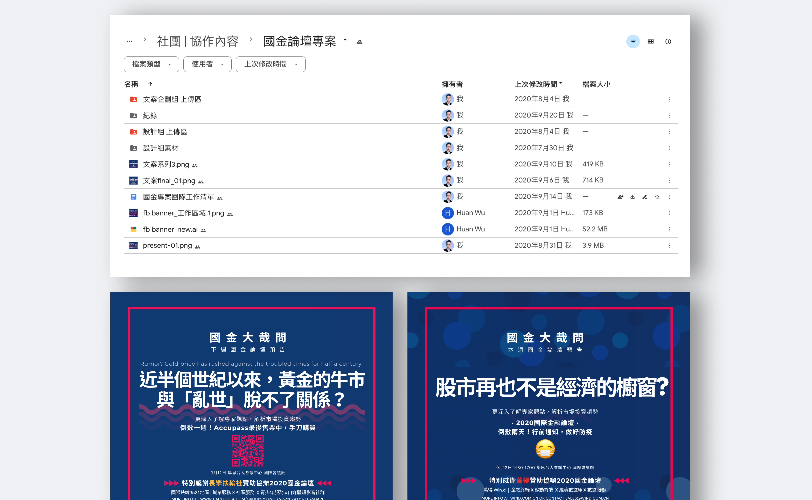

> Recap from [previously](/project/tmba-1/): All above is just the beginning. What's really challenging is where the root cause of the problem is, and happen to be my very reason why I choose to do in the first place, and not thinking about personal interest or opportunity cost.

### The Challenges

One thing that can be sure is the whole club needs the marketing function, whether it's doing editor works or thesedays social/content marketing stuffs, let alone something beyond. Most club leaders from different functions don't need to rely on the marketing resources to recruit the new members, as long as they have their resources from alumni, and their network to junior peers. This is the flying wheel that would keeps some major functions rolling and rolling spontaneously. Most department leaders just have to execute those milestones as before and coming up with something to make better on top of.  

In this scenario, club members won't find marketing necessary only when they have some bare minimum works which normally were out of their capabilites and goals, they would turn to find someone with specific marketing skills or simply a heart that willing to help.

This makes the brand positioning, the way this brand communicates and interacts with its customer unanimously and difficult to manage.

### The Partners that find each other 

